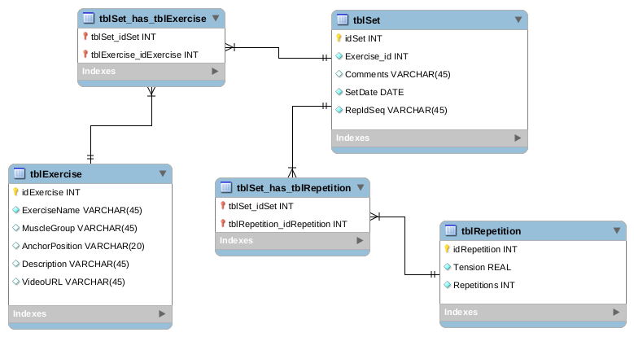

# BodyBand
[Java](https://www.linuxuprising.com/2019/06/new-oracle-java-11-installer-for-ubuntu.html) and SQL based workout recorder.

## Running BodyBand.jar from the command line ##

A compiled copy of BodyBand can be found in /JAR, with instructions, for Linux and Windows users. Note that the video URL function does not work in Windows (BodyBand is developed in Linux).

## Setting up the SQLite3 driver

SQLite3 driver is [here](https://bitbucket.org/xerial/sqlite-jdbc/downloads/). The SQLite browser is [here](https://sqlitebrowser.org/) with installation instructions.

In IntelliJ, click File then Project Structure and then Project Settings/Libraries. Add the SQLite JAR file.

## Setting up JavaFX11 for new projects

JavaFX downloads are [here](https://gluonhq.com/products/javafx/). Extract the files to a known directory and through IntelliJ add all the /lib/*.jar files to the Global Libraries. Right-click the parent project folder in IntelliJ (or just click File, Project Structure) and hit 'Open Module Settings'. Right-click 'JavaFX11' found under 'Global Settings' and 'Add to Project Libraries'. Then right click the 'src' folder and create a new module-info.java file. Add the following and save:

```java
module BodyBand {
    requires javafx.fxml;
    requires javafx.controls;

    opens sample;
}
```

Module in this case is the project name. The folder under the src folder was set to 'sample' (as project defaults) but can be changed there and above as required. 

The module-info-java file for BodyBand is included in /src. JUnit5 tests are also included for many of the fundamental methods defined in bbDatabase.

## Database schema

### Populating tblExercise

This table details how to set up the bands and where to position them for a given exercise.

### Populating tblRepetition

This table details the number of repetitions or 'reps' for a given band, and the band tension for a given rep. Bands can be doubled up or combined with other tensions and is a value which is ultimately determined by the user. It is assumed that the same units are (lbs or kg) are used throughout.

### Populating tblSet

This table links all other tables in BodyBand and provides a unique identifier to every single 'set' (one group of repetitions). Details about date and time are automatically included in this table.



The above schema was designed in MySQL workbench. The creation of the tables in SQLite using the MySQL datatypes will result in the following automatic SQLite datatype casts:

+ INT -> INTEGER
+ VARCHAR -> TEXT
+ DATE -> NUMERIC (implemented as TEXT in BodyBand)
+ REAL -> FLOAT (high precision is not required)

For this project, the SQLite datatypes are passed instead of using the MySQL datatypes.

# Development outline

The initial development stages are:

+ Create SQLite3 tables, including primary and foreign keys (Model)
+ Build simple CRUD framework through Java (Controller)
+ Implement simple JavaFX interface (Viewer)

## Basic setup

1. Design and build a settings page for the tables __tblExercise__.
2. Design and build an input page for __tblSet__.
3. Design and build a recall page which enables the user to view previous sets, searching by date.

## User interface flow

+ Initially, an admin version (raw exercise, band stat, repetition and set pages) will be added temporarily to test JDBC PreparedStatement queries and facilitate DB entry management. The admin version will then be adapted for the user but disabled by default.

In addition to the "Options" page, there are two main UI workflows for the general user:

+ "New workout" ------>   "Choose muscle group and exercise" ------>  "Rep page"
+ "Previous workout" --->  "Date"  ----->  "Exercises on the given date" ----> "Rep page"

The rep page is where the user can enter current rep count for a given exercise. For new workouts, the user can also view previous rep counts for the same exercise and estimate the _repetition maximum_ (or just "rep max", the maximum weight lifted for a given number of repetitions e.g. "1RM" is the "one rep-max" which represents the heaviest weight lifted _once_, "4RM" represents the heaviest weight lifted four times and so on. Additionally, the Exercise page will have menu bar to create, update and delete exercises.

## Future development

More advanced features and functionality could include:

- Port to Android and iOS using the JavaFXPorts plugin in Gradle (Gradle build started [here](https://github.com/jfspps/BodyBandGradle))

- Recording of personal bests

- Volume training trends (accumulated sum of weight lifted in a given session) plotted graphically.

- Goal setting
